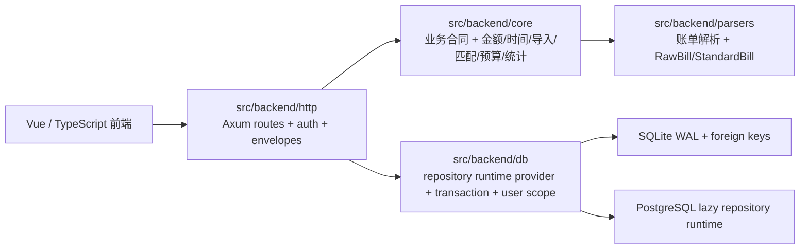
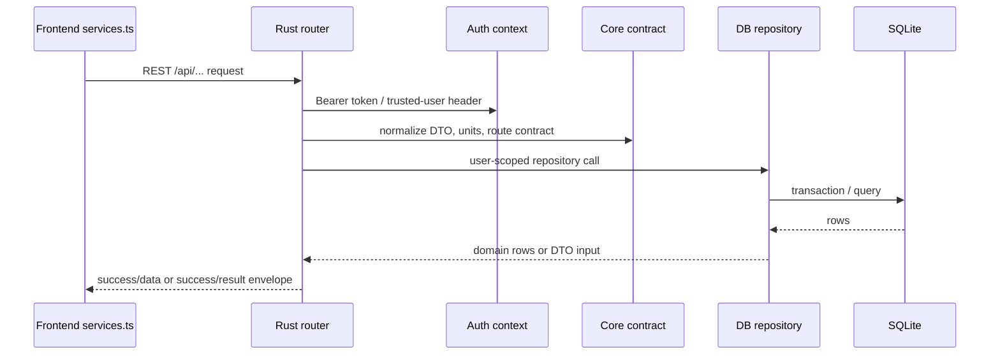
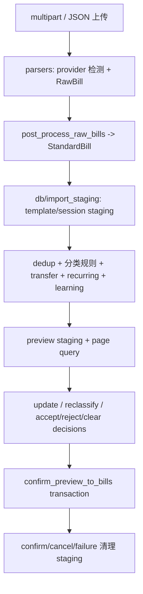
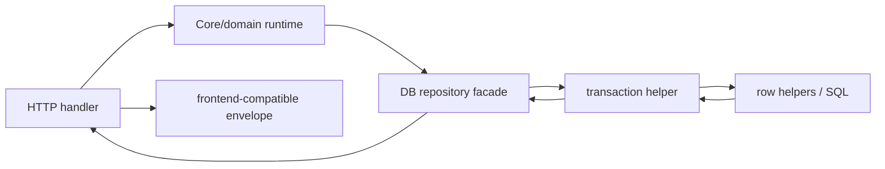

# Rust 后端导航图

Canonical source: docs/backend-map.md

本文是 Bill Analyser Rust 后端的维护入口。它描述当前运行态事实：`bill_http_server` 是唯一 HTTP 服务入口，业务 API 通过 Rust Axum `REST /api/...` 进入后端，数据库访问由 Rust repository/runtime 层承接。`docs/backend-map.html` 只是静态阅读入口，不是第二份事实来源。

<a id="backend-layering"></a>
## 后端分层



| 层 | 入口 | 责任 | 不能做 |
| --- | --- | --- | --- |
| HTTP | `src/backend/http/lib.rs`, `router.rs`, `bin/bill_http_server.rs` | 注册 `/api/...` 路由，解析认证上下文和请求 DTO，投影 response envelope | 不把复杂 SQL 或跨表事务散落在 handler 中 |
| Core | `src/backend/core/lib.rs` | 稳定业务合同、金额/时间/分类/统计 primitive、导入/学习/匹配/LLM/OCR/预算规则 | 不直接依赖前端临时字段或数据库行形状 |
| DB | `src/backend/db/lib.rs` | SQLite 连接、PostgreSQL lazy runtime provider、schema、事务 helper、user-scope repository、staging 生命周期 | 不绕过事务边界、静默回退仓储 backend，或把 user_id 过滤留给调用方猜 |
| Parsers | `src/backend/parsers/lib.rs` | provider 检测、账单解析、`RawBill` 到 `StandardBill` 标准化、fixture/golden 合同 | 不执行导入 staging、去重、分类或账户写入 |

当前库存：`src/backend/http` 112 个 Rust 文件，`src/backend/db` 74 个，`src/backend/core` 54 个，`src/backend/parsers` 9 个，总计 249 个。每个后端 Rust 文件都在文件头保留中文导读注释，说明该文件所在层、核心职责和主要对接边界。

### 常用根文件

- HTTP 运行态：`src/backend/http/lib.rs`、`src/backend/http/router.rs`、`src/backend/http/runtime.rs`、`src/backend/http/server.rs`、`src/backend/http/state.rs`、`src/backend/http/config.rs`、`src/backend/http/bin/bill_http_server.rs`
- HTTP route facade：`src/backend/http/auth_routes/mod.rs`、`src/backend/http/import_routes/mod.rs`、`src/backend/http/backup_routes/mod.rs`、`src/backend/http/bill_routes/mod.rs`、`src/backend/http/budget_routes.rs`、`src/backend/http/matching_routes.rs`、`src/backend/http/statistics_routes/mod.rs`、`src/backend/http/taxonomy_routes/mod.rs`
- Core 合同：`src/backend/core/import_pipeline.rs`、`src/backend/core/import_learning.rs`、`src/backend/core/matching.rs`、`src/backend/core/statistics.rs`、`src/backend/core/budgets.rs`、`src/backend/core/ai_ocr_llm/mod.rs`、`src/backend/core/primitives/mod.rs`、`src/backend/core/migration_governance.rs`
- DB repository：`src/backend/db/runtime.rs`、`src/backend/db/connection.rs`、`src/backend/db/schema.rs`、`src/backend/db/transaction.rs`、`src/backend/db/user_scope.rs`、`src/backend/db/import_staging.rs`、`src/backend/db/bills.rs`、`src/backend/db/budgets.rs`、`src/backend/db/auth.rs`、`src/backend/db/taxonomy/mod.rs`、`src/backend/db/matching.rs`
- Parser：`src/backend/parsers/lib.rs`、`src/backend/parsers/dedicated/mod.rs`、`src/backend/parsers/dedicated/WeChat.rs`、`src/backend/parsers/dedicated/Alipay.rs`、`src/backend/parsers/dedicated/ICBC.rs`、`src/backend/parsers/dedicated/CMBC.rs`、`src/backend/parsers/dedicated/ABC.rs`、`src/backend/parsers/dedicated/CCB.rs`、`tests/backend/parsers`

<a id="api-request-lifecycle"></a>
## API 请求生命周期



维护规则：

- 新 API 先在 `src/backend/http/router.rs` 或对应 route facade 中登记，再把复杂业务交给 core/db。
- response envelope 兼容性在 HTTP 层集中处理，前端 store 不应为同一字段重复补丁。
- 认证相关 route 必须明确当前用户来源；跨用户数据只能通过 user-scope repository 访问。
- 涉及金额、预算、统计、导入金额字段时，必须标注元/分边界并人工复核一次。

<a id="import-pipeline"></a>
## 导入管线



关键边界：

- parser 只负责识别来源和标准化账单，不写 staging。
- mixed multipart 必须保留每个文件自己的 parser id 和 parser tags。
- Check Data 首屏只读取 preview page；筛选、排序、计数和批量选择都由 Rust preview page/query/update 处理。
- transfer、learning、recurring、dedup、parser、annotation、reconciliation 信号从 `preview_matching_feedback_json` 投影，缺分类/缺账户状态按当前预览字段动态计算。
- confirm 在事务内写正式 bills、tags、accounts、learning side effects；cancel 和失败后新建 session 清理 staging，不保留导入续传状态。

主要源码与测试：

- `src/backend/http/import_routes/mod.rs`
- `src/backend/http/import_routes/stage_handlers.rs`
- `src/backend/http/import_routes/preview_mutation_helpers.rs`
- `src/backend/db/import_staging.rs`
- `src/backend/db/import_staging/`
- `src/backend/core/import_pipeline.rs`
- `src/backend/core/import_learning.rs`
- `tests/backend/http/import_runtime_contract.rs`
- `tests/backend/core/import_pipeline_contracts.rs`
- `tests/backend/core/import_learning_contracts.rs`
- `tests/backend/db/import_staging.rs`

<a id="repository-data-flow"></a>
## Repository 数据流



DB 层导读注释应优先解释：

- WAL、foreign keys、SQLite path guard、PostgreSQL lazy repository runtime 和 schema 幂等初始化。
- repository facade 供哪个 route/runtime 调用。
- user-scope 在哪里强制。
- 哪些写入必须 rollback-on-error，哪些审计是 best-effort。
- import staging 的 session/template/preview/decision/LLM memory/confirm 生命周期。
- row helper 负责数据库行和前端兼容 DTO 之间的字段转换。

<a id="development-recipes"></a>
## 开发路径

### 新增或调整 API

1. 在 `src/backend/http/*_routes*` 找到对应 route facade。
2. 确认认证上下文、请求 DTO、response envelope 和 user-scope。
3. 复杂规则放进 `src/backend/core`，SQL 放进 `src/backend/db`。
4. 更新 `docs/overview-api-routes.md` 和本文件的路径索引。
5. 运行 HTTP/domain focused tests；若 route ownership fixture 变更，再运行前端 route contract。

### 新增 parser

1. 在 `src/backend/parsers/dedicated/` 增加 provider 实现并登记。
2. 注释里说明 source identity、RawBill 字段来源、StandardBill 标准化边界和 fixture/golden 期望。
3. 不在 parser 中写导入 staging、分类、账户或去重。
4. 运行 `cargo test -p bill-analyser-parsers`。

### 修改导入预览

1. 先读 `src/backend/core/import_pipeline.rs` 和 `src/backend/http/import_routes/*`。
2. 明确影响的是 parser、dedup、preview page、selection、transfer、learning、recurring 还是 confirm。
3. 保持 `category_id`、账户、转账类型和 learning signal 与当前用户 taxonomy 兼容。
4. 运行对应 core/http/db 导入测试，并人工复核金额单位。

### 修改 repository 查询或 schema-adjacent 代码

1. 在 repository facade 中确认 user-scope 和事务边界。
2. schema 改动必须有迁移/初始化幂等说明；普通查询不要顺手改变 schema。
3. row helper 变化需要说明前端兼容字段含义。
4. 运行 DB focused tests 和结构门禁。

### 修改预算、统计或认证

- 预算：复核元/分、period 层级、父子预算派生和 import/export。
- 统计：复核汇率、账户过滤、日期范围和空账户图例。
- 认证：复核 token/session、2FA/step-up、user-data 操作、备份下载/恢复权限和审计。

<a id="verification-matrix"></a>
## 验证矩阵

| 变更范围 | 最小验证 | 扩展验证 |
| --- | --- | --- |
| 文档/静态 HTML | `node scripts/check-backend-doc-map.mjs`、`git diff --check -- docs scripts` | `node scripts/check-rust-backend-structure.mjs` |
| Parser 注释或小重命名 | `cargo fmt --all -- --check`、`cargo test -p bill-analyser-parsers` | parser fixture/golden 相关测试 |
| Core 合同注释或小重命名 | `cargo fmt --all -- --check`、`cargo test -p bill-analyser-core` | `cargo test -p bill-analyser-core --test import_pipeline_contracts`、`cargo test -p bill-analyser-core --test import_learning_contracts` |
| DB repository 注释或小重命名 | `cargo fmt --all -- --check`、`cargo test -p bill-analyser-db` | `cargo test -p bill-analyser-db --test import_staging` |
| HTTP route 注释或小重命名 | `cargo fmt --all -- --check`、`cargo test -p bill-analyser-http` | `cargo test -p bill-analyser-http --test import_runtime_contract`、`Set-Location src\web; npm run test -- frontendRustRouteContract` |
| 任意业务源码改动 | focused tests | `cargo clippy --workspace --all-targets -- -D warnings`、`cargo test --workspace`、`cargo llvm-cov --workspace --lcov --output-path workspace.lcov --fail-under-lines 90` |

最终验收还要运行：

```powershell
cargo fmt --all -- --check
cargo clippy --workspace --all-targets -- -D warnings
cargo test --workspace
cargo llvm-cov --workspace --lcov --output-path workspace.lcov --fail-under-lines 90
node scripts/check-rust-backend-structure.mjs
node scripts/check-backend-doc-map.mjs
git diff --check
```
