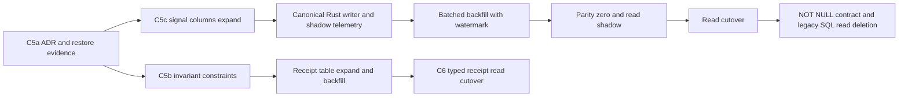

# Cyanflow C5 import schema expand/contract ADR

日期：2026-08-17

状态：`ACCEPTED`；C5b、C5c、C5d 已合并，C5e 本地实现与完整审计门禁完成，等待 exact-head CI；C5f 及后续阶段尚未启动

决策编号：`ADR-IMPORT-SCHEMA-001`

机器可读证据：`docs/refactor/evidence/cyanflow-c5-import-schema-benchmark-2026-08-17.json`、`docs/refactor/evidence/cyanflow-c5-import-signal-schema-expand-2026-08-18.json`、`docs/refactor/evidence/cyanflow-c5-import-signal-writer-shadow-2026-08-18.json`、`docs/refactor/evidence/cyanflow-c5-import-signal-backfill-2026-08-18.json`

可复跑基准：`Get-Content -Raw scripts/bench_import_signal_schema.sql | docker exec -i bill-analyser-postgres psql -X -U bill_analyser -d bill_analyser`

## 1. 决策摘要

C5 不重建 PostgreSQL，也不复制 issue/decision 状态。导入 schema 采用分步 `expand -> writer -> backfill -> shadow parity -> read cutover -> contract`：

1. 六个固定 signal 最终落为 `BOOLEAN NOT NULL` 列，并用独立 `signal_projection_version` 标识每行物化版本；expand 期允许 signal 列为 `NULL`，表示尚未物化。
2. 首版不增加 signal 专用索引，继续复用现有 session/page 索引；只有真实查询 p95 证明必要时才单独加索引。
3. Rust `PreviewStateKernel` 是 signal 语义唯一权威；原始 JSON evidence 的变更与新列只允许由同一个业务 writer 在同一事务中处理。正式 backfill 同样调用 Rust kernel；SQL 函数只作为只读 oracle，不能写新列。
4. session/user 归属使用复合外键，decision member 使用三类 partial unique index；保留合法的多引用 member，不增加“恰好一个 id 非空”的错误约束。
5. lifecycle CHECK 只覆盖已由当前代码和历史数据共同证明的值；`transaction_type` 与 `recommendation_type` 暂不约束，先解决中英文混用和用户定义边界。
6. terminal confirm receipt 迁入独立、每 session 唯一的表；metadata receipt 在兼容期作为同 writer 的旧投影保留，普通 staging cleanup 不得触碰新表。

## 2. 证据边界

基线来自本机 PostgreSQL 16.14 的开发数据库，采集时仓库 head 为 `a3994963b400f125064dd11a51fbc9ee82c21b0c`。完整 Rust PostgreSQL 测试会生成本地 session，因此数量用于 schema 规模、历史值和恢复演练，不推断为生产使用量。

- 数据库约 969 MiB；`import_preview_rows` 有 237,870 行，总大小 492,290,048 bytes，其中索引 60,973,056 bytes。
- 最大 session 为 `621`，有 13,084 行；它作为 query/write benchmark corpus。
- active 定义为 `created/parsing/preview/confirming`；当前 1,234 个 active session，最老 preview session 已存在 75.33 天。
- 所有 session metadata 中均无 contract/projection/pipeline version；C4 telemetry 之前创建的 active session 为 1,234 个。因此当前没有证据允许公开开启 session contract v2 或强制旧客户端 version 必填。
- 现有六类 child/session user mismatch 都是 0；nullable member 的目标 partial-key duplicate 也是 0，可以无损加约束。
- 9,098 个 member 中有 4,816 个同时引用多类实体，这是合法 lineage，不得压成互斥 member kind。

## 3. 合法值盘点

约束必须区分“当前库观察到”与“代码可合法产生”。

| 字段 | 当前观察值 | C5 允许值 | 裁决 |
| --- | --- | --- | --- |
| `import_sessions.status` | `parsing`, `preview`, `confirmed` | `created`, `parsing`, `preview`, `confirmed` | 保留 schema 默认 `created`；当前 writer 使用后三者 |
| `import_sessions.import_mode` | `preview` | `preview` | 可加 CHECK |
| `import_preview_rows.operation_kind` | `insert` | `insert` | 当前所有 production writer 均写 `insert`；可加 CHECK |
| `import_decision_groups.group_type` | `duplicate`, `historical_duplicate`, `same_batch_transfer` | 再加代码可产出的 `historical_transfer` | 可加 CHECK |
| `import_decision_groups.decision_status` | `pending`, `matched`, `merged`, `accepted`, `rejected` | 再加 reject/dematerialize 可产出的 `suppressed` | 可加 CHECK |
| `import_confirm_operations.operation_kind` | `decision_group` | `decision_group`, `history_rewrite` | 保留 migration 0018 已声明的 history idempotency 合同 |
| `import_confirm_operations.status` | `completed`, `failed` | `pending`, `completed`, `failed` | 可加 CHECK |
| `import_learning_lifecycle.status` | corpus 为 `green`；Stage 2 合同还使用 `pending`、`accepted`，规则中心会写 `disabled` | `yellow`, `green`, `auto_applied`, `downgraded`, `suppressed`, `pending`, `accepted`, `disabled` | 同表同时承载 core 阈值状态、Stage 2 兼容状态和规则启停状态；完整 DB 测试证明三类均是当前合同 |
| preview `transaction_type` | 中英文六种值 | 未冻结 | 先形成 canonical type/backfill 决策，当前不加 CHECK |
| learning `recommendation_type` | `classification` 与用户数据值 | 未冻结 | 属于用户/模型分类维度，当前不加 CHECK |

所有 CHECK 先以 `NOT VALID` 添加，使新写入立即 fail-closed；历史扫描通过后再 `VALIDATE CONSTRAINT`。未知历史值不得自动映射或删除。

## 4. Signal schema benchmark

基准在一个事务内创建临时表，结束统一 rollback；先预热 1 次，再测 5 次。查询范围固定为 session `621` 的 13,084 行，write 也固定插入 13,084 行。数字为 PostgreSQL 内部 `clock_timestamp` 计时。

| 候选 | Metadata p50/p95 | Learning page p50/p95 | Write p50/p95 | 结论 |
| --- | ---: | ---: | ---: | --- |
| 当前 JSON 函数 | 439.635 / 448.283 ms | 444.248 / 449.283 ms | 无额外 projection write | 淘汰为长期 read authority |
| 六列 boolean，仅 session 索引 | 1.935 / 2.039 ms | 1.426 / 1.466 ms | 19.518 / 20.274 ms | 选择 |
| 六列 boolean + 六个 partial index | 同列读取 | 约 0.03 ms 量级 | 31.316 / 32.987 ms | 写 p50 比基线高 58.46%，拒绝首版 |
| membership table | 2.267 / 3.192 ms | 0.030 / 0.031 ms | 46.969 / 52.624 ms | 固定六 family 下写 p50 高 137.67%，拒绝 |

等价基线表为 62,775,296 bytes；最小 boolean 表为 64,249,856 bytes，只增加 2.35%，且索引体积不变。最小 boolean write p50 为 19.518 ms，基线为 19.762 ms，差异属于测量噪声，没有观察到写退化。

这个 benchmark 只裁决 schema 形态和数据库成本。它以当前 SQL 函数生成对照 flags，不证明 SQL 与 Rust kernel 在 237,870 行上语义一致；全量 parity=0 仍是 writer/read cutover 的硬门禁。

## 5. 冻结 schema 合同

### 5.1 Signal projection

最终列名固定为：

```text
signal_parser BOOLEAN NOT NULL
signal_platform_duplicate BOOLEAN NOT NULL
signal_transfer BOOLEAN NOT NULL
signal_history BOOLEAN NOT NULL
signal_learning BOOLEAN NOT NULL
signal_llm BOOLEAN NOT NULL
signal_projection_version SMALLINT NOT NULL
```

`signal_projection_version=0` 表示 legacy/unmaterialized，`1` 表示 `PreviewStateKernel v1`。它是行级派生投影版本，不是 session mutation contract，也不是新的 CAS token；该列能在不改变 session/confirm 协议时独立 backfill 和重算，因此与 session version 分离有实际演进依据。

Expand migration 只添加 nullable signal columns 与默认 `0` 的 version，不建 signal 专用索引。Contract migration 必须在 `NULL=0`、unknown version=0、Rust/SQL/API parity diff=0 后才设置六列 `NOT NULL` 并要求 version=`1`。

### 5.2 Ownership

`import_sessions` 增加 `(id, user_id)` 唯一键；`import_sources`、`import_standard_rows`、`import_preview_rows`、`import_decision_groups`、`import_history_materializations`、`import_confirm_operations` 增加 `(session_id, user_id)` 复合外键。约束采用 additive `NOT VALID -> validate`，不删除已有单列外键，直到所有旧 binary 和查询均已验证。

source/standard、group/member 与 history/preview 的跨 session lineage 约束另做 focused migration；不得用应用层 user filter 代替数据库归属。

### 5.3 Nullable member uniqueness

不改成单一 `member_kind/member_id`，因为 4,816 个现有 member 合法地保存多引用 lineage。新增三个唯一 partial index：

```text
(group_id, preview_row_id, member_role) WHERE preview_row_id IS NOT NULL
(group_id, standard_row_id, member_role) WHERE standard_row_id IS NOT NULL
(group_id, history_bill_id, member_role) WHERE history_bill_id IS NOT NULL
```

旧的 nullable 组合 UNIQUE 在 compatibility window 保留；三项新索引验证稳定后再单独删除旧约束。

### 5.4 Confirm receipt

新增 `import_confirm_receipts`，每个 `session_id` 只允许一行，并保存 typed `receipt_schema_version`、`command_fingerprint`、`request_session_version`、`response_schema_version`、`http_status`、`success_envelope` 与 `created_at`。fingerprint 必须是 64 位小写十六进制，schema version 与 success envelope type 由 CHECK 保护。

当前 8 个 metadata receipt 都是 object，且都含 `receipt_schema_version`、`command_fingerprint`、`request_session_version`、`response_schema_version`、`http_status`、`success_envelope`，可以无损 backfill。新表不含 `updated_at`，普通 staging cleanup 清单不得包含它；账户级数据清理仍可通过 session FK cascade 删除。

兼容期 confirm 仍由唯一事务 writer 同时写新表和 metadata 旧投影。新表 read cutover 与 C6 typed outcome 同步完成；terminal replay 验证前不得停止 metadata 写入或删除旧读取。

## 6. Session 与兼容协议

本 ADR 不引入公开 v2 session。所有现有 session 都继续使用当前 read/mutation/confirm 合同；signal columns 是可回填的 server projection，不改变客户端协议。

- C4 `legacy_missing_version` telemetry 从 PR #315 部署后才开始提供证据，历史旧客户端版本不可反推。
- 公开 create/mutation/confirm 必须在同一 rollout gate 切换；本 C5 additive schema 不触发该 gate。
- 若后续必须引入 session contract version，当前 1,234 个 active legacy session 必须按明确 TTL/cancel-drain 完成；最长历史 75.33 天证明不能隐式升级或直接删除。
- terminal receipt 不属于 active drain；任何兼容清理都不得删除 receipt/replay 能力。

## 7. Expand/contract DAG



每一阶段都必须单独记录 writer、read、watermark、parity、rollback/forward-fix 和删除门禁：

1. C5b：CHECK、session/user composite FK、member partial unique；真实 PostgreSQL 必须证明非法写入被拒绝，0 skip。
2. C5c：只增加 nullable signal columns/version，不读新列；回滚是停止新 binary，不删列。
3. C5d：唯一 Rust writer 在原始 evidence mutation 的同一事务中写 columns；SQL 只 shadow 比较，不参与新写语义。
4. C5e：Rust backfill command 按主键 watermark 选择 `signal_projection_version=0` 的行，通过同一个 kernel 小批写入；每批提交、限速、可续跑，且永不覆盖 version=`1` 的在线写入。记录 rows/duration/mismatch，不执行单次全表 UPDATE。
5. C5f：query read 切到 columns；API/filter/count/facet 与旧读 parity=0，写 p95 退化不得超过 15%。
6. C5g：设置 NOT NULL、关闭旧 SQL read；至少三次真实 64 文件验收后才能删除兼容逻辑。
7. receipt 路径先 expand/backfill/shadow，再由 C6 切 typed read；同一真实 confirm 永不双执行。

C5d 已按上述边界实现：所有新行和 evidence mutation 行由 `PreviewStateKernel` 写 version `1`；selection-only 写入不升级旧行。批量 writer 在一个事务内保留最多 64 个确定性样本并只执行一次 legacy SQL 比较，避免按 500 行 chunk 重复增加数据库往返；真实 PostgreSQL 验收另行逐行核对完整测试批次，不以运行时采样代替放行 parity。生产 read、历史 backfill、NOT NULL 和 API 合同保持不变。

C5e 已实现独立 Rust 运维命令与 repository batch API。每批在固定 advisory lock 下拒绝水位之前仍存在 version `0` 缺口，随后按主键顺序锁定最多 1,000 行并通过 version `0` CAS 写入；不得用 `SKIP LOCKED` 越过低主键。投影复用 C5d 唯一 kernel，legacy SQL 仅在同一事务内对本批全部行做只读 parity。成功提交后才输出可持久化 JSON checkpoint，毒数据、migration/schema 错误、观察行数或 CAS 数量异常均整批回滚。C5e 没有修改生产 read、API、session 或 confirm 合同，也没有对长期开发数据库执行迁移或历史回填；目标库实跑 parity=0 仍是 C5f read cutover 的前置门禁。

## 8. Restore 与放行门禁

已完成一次 `pg_dump -Fc` 恢复演练：dump 为 60,209,715 bytes，SHA-256 `388cca87e6f13c9a98f3801e39595365a15382086aaa7e558d8b8cf56060c785`；恢复到独立 `bill_analyser_c5_restore_20260817` 后验证 24 条迁移、1,242 sessions、237,870 preview rows、5,043 decision groups、973 operations 和 signal 函数可读。临时数据库与 dump 已删除。

C5b 另以最终 migration 内容重新生成 60,209,715-byte restore point（SHA-256 `c890db568ceee62f25baf21aa98b7fe3f2e3a05502f2636d59c397f95d242e09`），在独立恢复库应用 migration 25：15 个约束全部 validated、3 个 member partial unique index 存在、ownership mismatch 为 0，4,816 条合法 multi-ref member 保留。该临时数据库、dump 与 SQL 副本均已删除。

C5c 使用 60,223,766-byte custom dump（SHA-256 `9b3fb40d46bf1551d631b12fb560f7e0a012e3bd620019909db592910b289a2b`）恢复 237,910 条 preview rows，并在独立恢复库应用 migration 26。迁移耗时 `489.302 ms`；六个 signal 列全部保持 `NULL`，全部行保持 `signal_projection_version=0`，未知版本为 0，signal 专用索引为 0，legacy signal SQL 函数仍可读；恢复前后表与索引尺寸未增长。独立恢复库、dump、容器内 SQL 副本和 coverage 临时库均已删除，原开发数据库未应用 migration 26。

每个实际 migration PR 仍须在执行前重新生成对应 head/data snapshot 的 restore point；本次演练证明流程可用，不替代未来数据快照。

放行要求：

- required PostgreSQL test 不可 skip，依赖缺失必须 fail-closed；
- migration 前 illegal/history preflight 为 0，后 parity diff 为 0；
- backfill 有 monotonic watermark、批次耗时、失败重试与取消证据；
- 新 writer 开启前确认 old/new 只有一个业务决策 owner；
- signal filter/count/page 的 p95、写入退化、表/索引尺寸均写入 evidence；
- receipt replay、普通 cleanup、账户级删除分别有真实 PostgreSQL 用例；
- 任一 destructive contract step 前重新完成 restore rehearsal。

## 9. Rejected alternatives

- 继续让 SQL/JSON 动态计算 signal：真实 13,084 行查询约 440 ms，且继续维护第二套状态机，拒绝。
- 六列加六个 partial index：稀有 filter 很快，但固定 corpus 写 p50 增加 58.46%，当前没有必要，拒绝首版。
- signal membership table：稀有 filter 最快，但固定六 family 没有扩展收益，写 p50 增加 137.67%，还增加 join/ownership，拒绝。
- 复制七个 issue 或四个 decision 到 preview row：制造第二事实源，拒绝。
- 一次迁移完成 add/backfill/not-null/read cutover：锁时长、回滚与 binary compatibility 不可控，拒绝。
