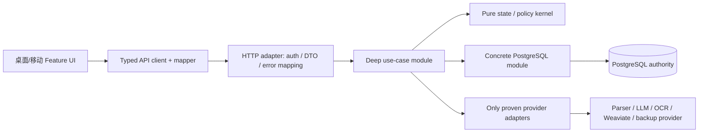

# Bill Analyser 可持续模块化架构重构共识（Cyanflow）

## 0. 文件状态

- 工件 ID：`bill-analyser.architecture.modular-monolith`
- 工件版本：`2.0.0-proposal`
- 形成日期：`2026-08-15`（Asia/Shanghai）
- 仓库基线：`main@345c095d7bd2421532a3c2f74184d408768b925c`
- 工作流：`Cyaness -> Cyanflow`
- Cyanflow 裁决：`lane=flow`、`activity=review`、`verification=adversarial`
- 执行纪律：`not_applicable`（本轮只做评估与共识，不进入 TDD 或实现）
- 当前状态：`CONSENSUS_COMPLETE / GOVERNED_STORE_ACCEPTANCE_PENDING`
- 实现授权：`false`
- OMX/OMO：`未启动，也不作为本共识的执行依赖`
- 正文内容摘要（marker 后 UTF-8/LF）：`sha256:c5fd36c458152eac4a58dce6169ac038968b48a952f434af84ac75c003fd4456`

本机 `harness 0.1.0` 只公开 Cyanflow `workflow start/resume`，没有公开 Governed Store 的工件接纳命令，仓库也没有 `.cyaness/` 状态目录。因此本文件是经 Cyanflow 评估完成的仓库内共识 proposal，不伪装成已经由 Governed Store 接受的 `.cyaness/specs` 工件。

本文件取代 `.omx/plans/consensus-project-modular-architecture-reconstruction-20260813.md` 的**目标模块地图、全局前置 DAG 和执行编排**。旧文件仍可作为历史证据，但不得再据此强制创建全局 `application/server` crate、八域镜像目录或通用 port/outbox。

`.omx/plans/consensus-import-system-reconstruction-20260813.md` 中已经确认的**导入业务需求**继续有效；其 P0-P7 实现顺序和预先冻结的具体 schema 改由本文件的证据门禁重新编排。

<!-- cyanflow-spec-body -->

## 1. 最终判断

### 1.1 底层选型没有错，底层边界确实有问题

不需要推倒以下技术底座：

- Rust Axum `bill_http_server` 继续作为唯一 HTTP 运行时；
- 业务主链继续使用 `REST /api/...`；
- PostgreSQL 继续作为唯一业务状态权威；
- Weaviate 继续只做可重建的 learning recall / 派生索引；
- Vue 3 + Pinia、parser-first、整数分/minor units、单体部署继续保留；
- 现有 confirm 的 session lock、CAS、单事务、receipt replay、history effect 和 cleanup 顺序继续保留。

当前真正的底层问题是**所有权和接口边界错位**：

1. HTTP 层直接加载数据库、写 SQL、编译规则并执行顺序敏感的业务编排。
2. DB 层除 SQL、锁和事务外，还决定业务状态并构造 HTTP status/JSON envelope。
3. Core 层保存 `status_code + serde_json::Value` 等传输语义，不再是稳定的业务内核。
4. 同一 signal/review issue 在 Rust、PostgreSQL JSON 函数、桌面 TypeScript 和移动端 TypeScript 重复定义。
5. 前端 API 合同和状态所有权过弱，server entity、draft、overlay、selection、迟到响应和显示注解互相覆盖。
6. 现有数据库总体可用，但部分 lifecycle、用户归属、nullable 唯一性、projection 和 receipt 不变量没有由 schema 可靠保护。

所以正确方向不是“重写技术栈”，也不是“再拆一轮文件”，而是：

> 建立证据门禁式模块化单体；先把一个业务真相收进一个深模块，再逐调用方迁移。只有真实重复调用、真实多 adapter 或明确编译收益证明后，才增加 trait、port 或新 crate。

### 1.2 对旧两份总共识的裁决

| 旧结论 | 新裁决 | 原因 |
| --- | --- | --- |
| 模块化单体、单 PostgreSQL、单 HTTP runtime | 保留 | 与当前规模和事务边界匹配 |
| 单一事实、单一 writer、渐进迁移 | 保留 | 是信号和导入状态长期稳定的必要条件 |
| HTTP 无 SQL、DB 无 HTTP response | 保留并升级为可执行门禁 | 当前已有直接反例 |
| 导入是第一个 pilot，但不是终点 | 保留 | 符合此前全域重构要求 |
| 立即创建全局 `application` crate | 降级为假设 | 会先形成转发层，尚无编译收益证据 |
| 立即创建独立 `server` crate | 删除前置要求 | 现有 binary 可以继续作为 composition root |
| 八个 bounded context 立即冻结并镜像到前后端 | 删除 | 混合了业务域、读模型、supporting module 和运维容器 |
| 所有 repository/provider 都先建 port | 删除 | 单 PostgreSQL 场景会制造只有一个实现的形式化接口 |
| 全局 OpenAPI/codegen 是导入前置 | 降级为后续工具 ADR | 先用 typed DTO + 跨语言 fixture 证明 drift |
| 六个 signal、七个 issue、四个 decision 全复制为 preview 列 | 取消冻结 | signal 候选合理，但 issue/decision 重复存储会制造新真相 |
| 通用 outbox/domain event/UnitOfWork | 删除 | 仅在真实异步投递或多实现需求出现时引入 |
| 52 秒阶段细分预算 | 取消冻结 | `<=60s` 总目标保留，阶段预算必须由可复跑基线重新分配 |

## 2. 用户需求总账

以下要求是本次和此前需求的合并结果，重构不得悄悄缩减。

规范性来源和冲突顺序：

1. 本文件负责项目架构、模块 ownership、抽象准入、迁移顺序和 schema/API 决策门禁。
2. `.omx/plans/consensus-import-system-reconstruction-20260813.md` 的 3.1-3.7、7、8 节继续作为导入业务、性能和测试的规范性附件；该文件 5.3 的预选 schema、P0-P7 顺序和执行引擎内容已被本文件取代。
3. `.omx/specs/deep-interview-import-signal-system-audit.md`、`.omx/specs/deep-interview-import-64file-performance-signal-taxonomy.md`、`.omx/specs/deep-interview-import-preview-fixes.md` 和 `.omx/specs/deep-interview-transaction-import-dialog-ui.md` 保留更细的旧验收场景。
4. 发生冲突时，用户可见行为、安全、金额、数据完整性和 `<=60s` 总 SLA 取更严格合同；内部目录、crate、port、schema 列和阶段编号以本文件为准。任何无法按此规则消解的冲突必须先形成新 Cyanflow 决策，不得由实现者现场选择。

### 2.1 项目级目标

1. 建立能长期迭代的模块化架构，不再靠巨型文件、兼容分支和跨层 helper 野蛮生长。
2. 以业务能力、状态所有权和事务不变量组织代码；文件大小只是辅助指标。
3. 导入预览是首个高风险 pilot，完成后必须继续迁移正式交易、分类规则、身份、预算、报表和数据移植等领域，不能止于导入。
4. 默认不做 UI 视觉重设计，不改变桌面/移动现有入口和主要工作流。
5. 重构与业务修复分开切片；但“缺少分类不消失”等当前痛点允许先做可逆止血，不能等全局框架完成。
6. 重要导出函数、业务不变量和复杂 helper 使用简洁中文注释；不为显然代码堆叙述性注释。
7. 真实运行入口、真实 PostgreSQL、真实浏览器和可复跑证据决定完成，不接受仅靠 Git、mock 或 silent skip 的假绿。

### 2.2 稳定运行合同

1. `bill_http_server` 是唯一 HTTP runtime；不恢复 sidecar 或 `/api/v1/*` 主链。
2. PostgreSQL 是事实权威；Weaviate、前端 cache 和 SQL projection 都不能反向改写事实。
3. core、DB、HTTP DTO 和前端 API model 使用整数分或显式 minor units；元只存在于输入、显示、parser/OCR/LLM 等外部边界。
4. user scope、token session authority、SSRF、secret redaction、备份路径安全不得退化。
5. 外部 REST 默认冻结 method/path、成功/错误 status 语义、envelope key、必需字段和业务行为。纯展示错误文案不是永久 ABI，除非客户端测试证明依赖；兼容字段必须登记 owner 和删除门禁。

### 2.3 导入顺序和解析能力

冻结主链：

`exactly-one parser -> 标准化 -> dedup/history/structured transfer -> 分类 -> recurring/learning/LLM -> 账户规则 -> preview -> confirm -> cleanup`

1. dedicated 文件必须且只能命中一个 parser；no-match/conflict 不得静默选择。
2. 未命中 dedicated parser 的 CSV/TXT、HTML、XLS、XLSX 必须继续进入 generic 列映射路径。
3. generic preview 样本不得被误当成完整正式导入数据。
4. dedup、history 和结构化 transfer 必须先于分类与账户规则。
5. 只有结构化 transfer feedback、历史转账事实或用户在 preview 的合法人工选择可以产生转账；分类规则、recurring、learning、LLM、Weaviate、账户规则和原始文本没有自动转账权限。
6. 普通收入、支出、投资可以依据合法分类规则、learning 或人工审核迁移；投资升级后继续执行投资账户规则。
7. `ImportContextSnapshot` 只在一次 Stage 2 批次内 immutable；preview mutation、reclassify 和 confirm 必须重新读取当前用户 active taxonomy/account。
8. 请求内直接上传继续受 HTTP body limit 和单文件 10 MiB 硬上限保护；标准账单字符串与容器物化继续受 64 MiB 请求级预算约束。
9. Stage 1 有界并发必须保持输入顺序、错误归属和取消语义；压缩 XLS/XLSX 使用独立并发限制，ZIP entry、展开字节、worksheet 和行列/单元格预算失败关闭。
10. 资源不足、损坏文件、压缩炸弹或 worker 取消不得持久化部分 Stage 1 结果。

### 2.4 六类正式信号与 review issue

正式可见且可筛选的 family 只有：

- `parser`
- `platform_duplicate`
- `transfer`
- `history`
- `learning`
- `llm`

冻结语义：

1. `parser` 只表示 parser-only 行，必须排除另外五类可见信号。
2. 除 parser-only 外，family 可以重叠；疑似转账推荐必须同时属于 `transfer` 与 `learning`。
3. display、filter、facet/count、轻量索引、完整 hydration、跨页选择必须消费同一 membership 结果。
4. `recurring`、`reconciliation`、`identity_validation` 是辅助 review context，不进入六类筛选。
5. 缺少/非法分类和来源/目标账户属于 `ReviewIssueSet`，不是 signal。
6. 合法 active 分类/账户写入后，相关 issue 必须在同一 UI 更新周期消失，并在服务端响应、翻页、刷新和重新进入 session 后保持消失。
7. 原始 `/`、支付方式或 POS 文本只能作为 evidence，不能成为 canonical category/account ID。
8. 阻塞 issue 存在时不得仅隐藏芯片；必须取消选择或阻止 confirm。
9. 未知非空 signal/decision/lifecycle 状态必须 fail-closed，不得进入筛选、计数、自动应用或 confirm。

### 2.5 决策、人工归属和确认

1. transfer、history、learning、LLM 保持各自独立 lifecycle，不强行塞进一个通用 workflow enum。
2. `auto_applied` 是正式状态，不能在重构中丢失。
3. no-op edit 不清理有效 decision；实质编辑只 invalidates 依赖已变化字段的 decision。
4. accept/reject/clear 持久化并返回权威 preview snapshot，刷新不得复活旧状态。
5. 疑似转账 accept 保留合法分类、来源/目标账户和人工字段；reject 撤销 pair 后原子重算两行的非人工字段，禁止简单清空。
6. confirm 必须在 session lock 下重读当前 selected rows、active taxonomy/account 和 decision/history 状态，在一个 SQLx transaction 中写正式交易、history effect、receipt 和 cleanup。
7. 任一步失败全部回滚；相同 fingerprint replay 原 receipt，不同 fingerprint 冲突；同一真实 session 绝不双执行 confirm。
8. 只要一次迁移需要并存不同 session contract，每个 session 创建时固定唯一 contract version；同一 session 的 read、mutation 和 confirm 不得混用新旧 writer。
9. 新 contract 的公开 create、mutation 和 confirm 必须作为同一 rollout gate 开放；confirm 尚未可用时，新 session 只能属于显式 internal/shadow cohort，不能暴露给普通用户。
10. 停止创建旧 session 后，既有 active session 继续按旧合同完成或显式 cancel；TTL、`updated_at` 刷新语义、owner、告警和 cancel-drain UX 必须在删除旧读取前冻结。terminal receipt 不计入 active drain，也不能被 compatibility cleanup 删除。
11. confirm 或 history effect 失败时，事务回滚且 staging 保持可重试；只有成功提交并持久化 receipt 后才能清理 child staging。

### 2.6 前端和性能

1. 文件选择器在平台支持时继续默认定位 `bills/`；进度条只突出当前步骤。
2. 桌面/移动分类最多两级，保留一级分类下新建二级分类的入口。
3. 有选择时 learning/LLM 批量动作只处理选择集；无选择时处理当前过滤结果全集。
4. 迟到响应不得覆盖更晚的 draft、selection 或 reclassify 结果。
5. 固定 64 文件 corpus 从 browser submit 到第一屏可编辑、信号完整、筛选可用的 preview，连续三次每次 `<=60s`。
6. 不允许关闭或延后第一屏必需的 dedup、transfer、history、classification、identity、learning/LLM projection 来制造快结果。
7. 允许有界并发、批处理、索引、请求内中间结果复用和规则预编译；不允许 same-file 结果缓存掩盖性能。
8. 日志有阶段摘要、相关 ID 和 build provenance，但不记录交易正文、凭据、fingerprint 原文或 acknowledgement secret。
9. 在 C0 没有用新 corpus 证据正式重标前，继续保留旧导入共识的查询目标：约 13k preview rows 下 metadata/facet p95 `<=300ms`、page p95 `<=500ms`、preview-item mutation p95 `<=1s`；重标必须记录机器、数据量、查询形态和理由，不能静默放宽。

## 3. 当前证据

### 3.1 物理拆分已有价值，但不能证明模块化完成

在 `345c095d7` 上重新计算：

- `src/backend + src/web/src` 共 `1,196` 个 Rust/Vue/TS/JS/SCSS/CSS 文件；
- `12` 个文件超过 1,000 行，`45` 个文件超过 600 行；
- 最大文件仍是 `ImportTransactionCheckDataTab.vue`，共 `5,028` 行；
- `services.ts` 为 `1,889` 行，`ImportDialog.vue` 为 `1,774` 行；
- Rust structure gate 扫描 `587` 个文件、3 个 baseline，当前通过；
- frontend structure gate 扫描 `609` 个文件、39 个 baseline，当前通过。

这说明 D1-D10 的 facade + 子文件工作不是失败，而是已经完成了第一阶段物理整理。现在的主要矛盾是语义所有权、依赖方向和状态权威，不能再用“行数下降”冒充架构完成。

### 3.2 API/模块边界有当前代码证据

1. `src/backend/http/Cargo.toml` 同时直接依赖 `core`、`db`、`parsers` 和 `sqlx`。
2. 排除测试后，当前有 7 个 HTTP production 文件直接包含 SQLx query；包括 Stage 2、taxonomy、LLM 和 learning 路径。
3. `stage2_chain.rs` 的 `apply_import_intelligence_chain` 在 HTTP 层加载分类、分类规则、账户、账户规则、learning、recurring，执行顺序敏感变换并持久化 baseline。
4. `core/import_pipeline/responses.rs` 的 `ImportV2RouteResponse` 直接保存 `status_code: u16` 和 `body: Value`。
5. `db/import_staging/confirm/orchestration.rs` 在数据库事务里调用 core response helper、生成 HTTP status/JSON envelope，再把该 envelope 写入 receipt。
6. `src/web/src/lib/services/importPreview.ts` 当前有 29 行使用 `Record<string, unknown>` 或 `unknown`，confirm、preview、decision 等高风险合同没有稳定类型。
7. `ImportPreviewRow` 不暴露 DB `version`，`ImportPreviewExpectedState` 也没有 row version；但数据库 mutation 会递增 version，前端竞争写入无法完成完整 CAS 合同。

### 3.3 数据库不是整体错误，但有已证实的不变量缺口

`0001_initial_authoritative_schema.sql` 已有整数分、外键、部分 CHECK 和 version，这是保留资产。以下风险有当前 schema 证据：

1. `import_sessions.status`、`operation_kind`、`transaction_type`、`decision_status`、`group_type` 和多类 lifecycle status 使用无 CHECK 的 `TEXT`。
2. 多个 import child table 同时保存 `session_id` 与 `user_id`，但没有复合 FK 证明该 session 属于同一 user。
3. `import_decision_group_members` 用多个 nullable member id 构成普通 UNIQUE；PostgreSQL 的 NULL 语义不能可靠阻止重复成员。
4. migration 0020 每次从 `preview_payload`/matching JSON 重新推导 signal flags；Rust 和 TypeScript 又实现同一语义。
5. terminal confirm receipt 当前嵌入可变的 `import_sessions.metadata`，schema 无法独立约束 receipt 唯一性、不可变性和 replay 字段完整性。

### 3.4 性能和用户问题的证据边界

2026-08-13 计划记录的运行日志显示 64 文件、15,041 标准行，Stage 1 为 `141,359ms`，Stage 2 为 `30,798ms`，远超 `<=60s` 目标；同一 session 有 2,384 条真实缺少分类记录。但该日志没有运行 binary SHA、corpus hash、脱敏配置快照和完整 browser marker，因此：

- 它足以证明“必须先 profile，不可宣称当前稳定可用”；
- 它不足以作为新实现的正式 release baseline；
- “缺少分类始终不消失”不能只归咎于数据库脏数据，必须分别验证真实缺失分类与前端 stale issue 两条路径。

## 4. 新架构框架

### 4.1 采用：证据门禁式模块化单体



该图描述职责，不要求立即一一映射为 crate。第一阶段优先在现有 crate 内建立深模块和局部依赖门禁；当编译隔离有真实收益时再提取 crate。

### 4.2 四个已证明的业务所有权区

这四个是当前可用于迁移的 ownership 区，不宣称已经完成最终 bounded context 设计。

| Ownership 区 | 当前冻结的责任 | 暂不拥有 |
| --- | --- | --- |
| Ledger | 账户 aggregate、正式交易、余额、最终 transfer effect | 分类规则、导入 staging |
| Classification | 分类、标签、分类规则、账户识别规则 | 账户余额和正式交易 |
| Import | session/source/standard row/preview/selection、导入 decision intent、confirm intent/receipt | 正式交易事实、provider 原始事实 |
| Identity | Principal、token session authority、用户作用域和 step-up | 各业务域自己的数据写入 |

说明：账户主数据及余额归 Ledger；“账户识别规则”归 Classification，通过 `AccountId` 和只读 snapshot 引用账户。这样避免旧 Taxonomy 同时承担账户资金事实和分类规则。

统一术语：概念上的正式账本对象称为 `LedgerEntry/正式交易`，现有 `/api/bills`、DB `bills` 和兼容 DTO 名称在迁移期不改；`StandardBill` 仅表示 parser 归一后的标准观察；`ImportPreviewRow` 表示尚未确认的候选。三者不得在新业务接口中混作同一种 entity。

以下先作为 supporting modules，不急于升级为独立 bounded context：

- `parsing`：外部账单到 `StandardBill`/标准观察；
- `matching`：dedup/transfer/history candidate；
- `recurring`：周期候选和模板语义；
- `recommendation/learning`：candidate、feedback 和学习策略；
- LLM、OCR、Weaviate：provider/adapter，不拥有最终业务事实。

`budgeting`、`reporting`、`portability` 在 import pilot 后按同一证据门禁迁移。`Automation` 和 `Operations` 不再作为兜底大域。

### 4.3 技术层的固定责任

| 层 | 允许 | 禁止 |
| --- | --- | --- |
| HTTP | auth context、request validation、DTO mapping、error/status/envelope mapping | SQL、业务状态机、规则编译、逐行 pipeline |
| Deep use-case module | 顺序编排、业务权限、调用 concrete persistence/provider、返回 typed result | Axum extractor、HTTP status、raw SQL、前端 view state |
| Pure kernel | 值对象、不变量、状态机、纯 projection/planner | SQLx、HTTP、I/O、任意 JSON 作为 canonical state |
| PostgreSQL module | query、row mapping、锁、事务、constraint、migration | HTTP response、重复业务状态机、provider 调用 |
| Provider/parser adapter | 外部输入/输出、资源预算、typed observation/evidence | 写 canonical business decision |
| Frontend feature | typed API、entity/draft/overlay、selectors、UI orchestration | raw response 猜测、跨端重复业务状态机 |

### 4.4 抽象准入规则

1. **模块准入**：必须隐藏真实复杂度、服务多个真实调用点，或通过 delete test 证明删除后逻辑会重新散落。
2. **trait/port 准入**：原则上至少有两个生产实现；单 PostgreSQL repository 不为“未来也许换库”预建 trait。
3. **provider port 准入**：已有多个 provider 时可建立窄接口；不同语义的 LLM/OCR/Weaviate/邮件不得塞进万能 `ExternalProvider`。
4. **crate 准入**：只有当模块已稳定、跨 crate 消费或编译依赖门禁能明显减少误用时提取；不创建空壳 `application/server` crate。
5. **shared 准入**：只能放无业务所有权的 primitive/testing/infrastructure；出现业务词汇即回 owning module。
6. **无框架税**：禁止通用 `UnitOfWork`、万能 CRUD repository、通用 workflow engine、每个领域模板化复制同一目录树。

## 5. 首批深模块

### 5.1 `PreviewStateKernel::derive`

建议在现有 import core 中加深，而不是新建万能 domain layer：

```rust
pub fn derive(input: PreviewStateInput) -> PreviewState;
```

输入是 typed facts、evidence adapter 结果、decision、人工 ownership 和分类/账户有效性；公开接口不得继续接受松散 `Map<String, Value>`。

输出至少包括：

- `SignalSet`
- `ReviewIssueSet`
- `DecisionStateView`（对各 lifecycle owner 当前状态的只读投影，不是第二份持久化状态机）
- `EffectivePreviewFields`
- 必要时的 projection contract/version

Rust kernel 是 signal、服务端 issue、合法性和 effective row 的唯一业务语义权威；canonical writer 把其结果持久化为 typed server snapshot。完成 cutover 后，SQL 只能读取该 projection 做 page/filter/count/facet/confirm，不能再从 JSON 重算。TypeScript 的 signal 只能映射 server snapshot；前端只允许针对尚未提交的 draft overlay 计算非持久化 `ProvisionalIssueDelta`，用于当前帧提示，不能参与服务端 filter/count/selection/confirm，也不能写回成为第二事实。跨语言 fixture 是迁移和 provisional UI 的约束，不是长期保留三套状态机的许可。

### 5.2 `ImportStage2::evaluate`

```rust
pub async fn evaluate(command: EvaluateStage2) -> Result<Stage2Result, ImportError>;
```

该深模块隐藏：

- 一次 batch-scoped context snapshot 加载；
- dedup/history/transfer、classification、recurring/learning/LLM、account resolution 的固定顺序；
- manual ownership 和 transfer authority；
- 批量副作用与 preview/baseline persistence。

它已有 initial、reclassify、decision-group/dematerialized reclassify 等真实调用证据，因此可以建立公共模块接口；但只有一个 PostgreSQL loader 时不先建 repository trait。

### 5.3 保留并净化现有 confirm 深入口

现有 `confirm_import_command` 已经隐藏 lock、CAS、history、bill writes、receipt 和 cleanup，不再套一层 `ConfirmCommitPort` 或 UnitOfWork。

公开边界改为小型 `ConfirmIntent -> ConfirmOutcome`：

- `ConfirmIntent` 只含调用方需要的 session、expected version、selection mutation、patch mutation 和 acknowledgement 意图；其中 selection/patch 是锁内先执行且分别受 session/row CAS 保护的命令，不是权威 snapshot；
- mutation intent 应用后，PostgreSQL module 必须在同一事务中重新读取 selected rows、active taxonomy/account、decision/history 和版本，再生成 authoritative plan；caller 提交的 selection/patch 内容不得直接进入最终 write-set；
- 内部 deterministic `ConfirmPlan/write-set` 只供事务内 planner、shadow parity 和测试使用；
- PostgreSQL module 返回 typed `ConfirmOutcome`，HTTP adapter 负责兼容 status/envelope；
- terminal receipt 的旧 envelope 在迁移期继续可读，不能破坏 replay。

### 5.4 低风险框架 canary

在深入迁移 Import 前，用 `/api/bills` 列表做一个低风险 canary：

`HTTP mapper -> LedgerQueries::list(principal, query) -> PostgreSQL query module -> LedgerEntryPage`

目的不是新增层数，而是证明四件事：

1. handler 可以不打开 DB runtime、不解析数据库 row；
2. typed query/result/error 足够表达现有 REST 行为；
3. 不需要先造全局 application crate；
4. 错误依赖和正确路径可以被局部门禁识别。

若 canary 只产生转发 wrapper、没有减少 handler knowledge 或测试复杂度，则删除它并修订模式，不把失败抽象复制全仓。

## 6. API 与前端合同

### 6.1 API 演进

1. 先在 Ledger canary 和 Import 建立 Rust typed DTO、TypeScript typed DTO、共享 JSON fixture 和 route contract test。
2. migrated endpoint 禁止 `Value`/raw DB row 跨过 application 边界，前端禁止 `Record<string, unknown>`/`any`。
3. CAS 采用兼容迁移：先在 response additive 暴露 `row_version`，同时 characterization 当前无 version mutation/conflict 行为；此阶段 server 接受缺失 `expected_version` 的旧客户端并记录 legacy telemetry，不宣称它具备 CAS 保证。
4. 当前 web client 完成 cutover 后，竞争 mutation 携带 `expected_version`；成功返回最新 typed snapshot，409 返回当前 version 和可安全返回的最新 snapshot，前端必须显式处理冲突。
5. 只有 legacy 调用连续观察为 0、兼容期限和外部客户端影响已记录，并获得 breaking-contract 明确批准后，server 才能 enforce `expected_version` 必填；此前缺失 version 只能进入命名的 legacy 分支，不能静默伪装成 CAS。
6. 非竞争 CRUD 不强制 CAS；idempotency key/fingerprint 只用于 confirm、外部 effect 和可重试命令。
7. OpenAPI/codegen 不是前置。只有至少两个不同 endpoint family、两个生成消费者或实际 drift 数据证明收益后，再以独立 ADR 选择工具。

### 6.2 前端 Import feature

只为已迁移的 import preview 建立中性 feature，不预建全仓八套目录：

```text
features/import-preview/
  api/       typed DTO/client/mapper
  model/     API row -> effective row；signal/issue selectors
  store/     entitiesById、draftOverlayById、selection、request generation
  ui/        desktop/mobile 共享的无状态业务组件（确有复用时）
```

状态合同：

```text
typed server snapshot + local draft overlay = effective fields
server snapshot.signals --------------------> visible signals
effective fields -> provisional issue delta -> current-frame UI only
server snapshot.issues + provisional delta -> visible issues / valid / actions
```

- desktop/mobile 只能通过同一个 API-row adapter 映射 server signal/issue；signal 不得从 raw JSON 重算；
- provisional issue selector 只校验用户尚未提交的分类/账户 draft，并在 server ack 后立即丢弃；服务端 snapshot 始终决定 filter/count/selection/confirm；
- page/SFC 不直接解析 raw response，不持有长期 annotation truth；
- mutation ack 用完整权威 row 替换 entity，再清理对应 overlay；
- generation/AbortController 保证旧响应不覆盖新状态；
- 拆分验收以状态所有权消失为准，不以组件行数下降单独验收。

## 7. 数据库重构合同

### 7.1 保留与先修内容

保留单 PostgreSQL 和现有数据。优先用 additive migration 修复已证明的不变量：

1. 为实际合法值已盘点的 session/operation/decision/lifecycle `TEXT` 增加 CHECK 或等价受控类型。
2. 对同时保存 parent/session 与 `user_id` 的 child table，选择复合 FK 或删除冗余 `user_id`，保证归属不能伪造。
3. 把多 nullable member UNIQUE 改为明确 `member_kind + member_id` 或 family-specific partial unique indexes。
4. 竞争 aggregate 使用现有单调 version 做 CAS，并把 version 暴露给 API；不要求所有 mutable row 一刀切增加 CAS。
5. terminal receipt 必须具备数据库可验证的唯一性、schema version、fingerprint/replay 字段和不可被普通 cleanup 改写的约束。使用独立表、受约束生成列或其他方案由 migration ADR 决定。
6. migration 使用 `expand -> backfill -> shadow parity -> writer cutover -> contract`；不使用破坏性 DOWN 假装可回滚，删除后以兼容 binary/forward-fix 和已验证备份恢复为边界。

### 7.2 不预先复制的新真相

1. 六个 signal 的默认候选是 typed boolean projection，因为当前集合固定、允许多 membership、查询频繁；但必须先用真实 corpus 对 JSON 现状、boolean columns 和必要时 membership table 比较 `EXPLAIN`、写入退化、索引体积和 parity，再冻结 schema。
2. identity issue 默认从 typed category/account facts 和 active snapshot 派生；没有 profile 证据时不复制七个 issue boolean。
3. transfer/history/learning/LLM decision 继续由各自 lifecycle owner 持有，不把四个 decision state 再复制到 preview row。
4. `manual_fields_mask` 在人工字段集合、变更频率和未知 bit 策略未盘点前不冻结；可先使用 typed ownership set/document。
5. `pipeline_version` 与 `projection_contract_version` 只有证明能独立演进时才拆成两个 token；否则使用一个 session contract version。
6. JSONB 可以保存 raw evidence、版本化配置和兼容 envelope；参与筛选、合法性、唯一性、生命周期或 confirm 的权威字段不能只靠任意 JSON key。

## 8. Cyanflow 迁移顺序

这是一条滚动 conveyor，不绑定 OMX、Goal 或 Team。每个切片完成后由 Cyanflow 重新评估下一动作。

### C0：证据与门禁基线（只读/治理）

- Entry：本共识仍为 implementation unauthorized；只允许读取仓库和现有本地运行证据。
- 工作：建立 route -> use case -> writer/table、前端调用方和 session/receipt ownership ledger；固化 dependency、HTTP SQL、core transport、weak DTO、schema invariant debt；固化 64 文件 corpus hash、binary SHA、配置快照、browser marker 和阶段日志；设计 architecture ratchet。
- 固定工件：ownership matrix、architecture debt baseline、64-file evidence manifest、recognition-quality fixture、C1 transition ledger。
- Exit：所有 C1-C6 路径有当前/目标 owner、唯一 writer、old/new read、rollback/forward-fix 和 delete gate；性能基线可复跑；必需环境缺失或 browser marker 不完整时 fail-closed。

### C1：两项小 canary

- Entry：C0 工件齐全；Ledger list 和 missing-category 当前行为已有 characterization tests；两项各自有独立 rollback。
- 工作 1：Ledger list 边界 canary，证明 typed query/result 和薄 HTTP handler。
- 工作 2：缺少分类立即止血。C1 必须直接删除 `ReviewIssue` 的手工 revision/annotation cache 权威，改为 `server issues + draft-only ProvisionalIssueDelta`；不得用额外 refresh 或手工 invalidation 掩盖根因。
- 固定工件：Ledger route contract fixture、handler knowledge/delete-test 报告、missing-category SFC/selector/browser evidence、C1 diff coverage。
- Exit：Ledger handler 不打开 DB runtime、不解析 DB row且 REST parity 为 0；合法分类后的 issue 在同一 tick、ack、翻页、刷新和重新进入均消失；旧 issue cache/revision writer 为 0。C1 不改导入 schema、不做 UI 改版，任一 browser case skip 即失败。

### C2：PreviewStateKernel

- Entry：C1 的 issue cache 已删除；六类 signal、issue、unknown-state、likely-transfer 双 membership fixture 已冻结。
- 工作：建立 typed input/output；Rust canonical projector 生成 typed server snapshot，并由集中 compatibility adapter 序列化现有存储/response；旧 SQL/desktop/mobile 推导只做 read-only shadow oracle；TypeScript signal 改为 snapshot mapping。C2 不在 benchmark 前预选 signal schema，也不切换 SQL filter reader。
- 固定工件：table-driven canonical fixture、old/new row parity report、unknown-state fail-closed report、projection ownership record。
- Exit：fixture 和真实 shadow sample 的未解释 parity diff 为 0；新/修改行只由 Rust projector 决定 signal/issue；desktop/mobile 不从 JSON 重算 signal；legacy SQL 仍只读旧兼容投影，不获得写权，也不新增规则，并有 owner、只读证明和 C5 reader cutover/delete gate。

### C3：ImportStage2 深模块与性能

- Entry：C2 kernel 稳定；initial/reclassify/decision-group 三条调用路径、阶段顺序、资源预算和 recognition quality 有 behavior lock。
- 工作：三个调用方切到 `ImportStage2::evaluate`；context 每批只加载一次；SQL/规则加载离开 HTTP；profile 后做有界并发、批量 I/O、规则预编译和中间结果复用；保持 10 MiB/64 MiB、压缩 worker、取消和有序归并合同。
- 固定工件：调用图前后对比、Stage 1/2 profile、RSS/预算/取消报告、recognition parity、重新分配的互斥阶段预算。
- Exit：三个调用方只进入新深模块；相关 HTTP production SQL 为 0；资源预算/恶意输入全部 fail-closed；Stage 1/2 达到 C0 分配预算且总预算为 upload/browser 抖动保留余量。完整 browser `<=60s` 仍在 C6 终验，不以单阶段变快代替。

### C4：Typed Import API 与前端状态

- Entry：C2 提供 typed server snapshot，C3 提供稳定 use-case result；当前 REST/冲突行为和 legacy client 调用有 characterization/telemetry。
- 工作：preview/query/mutation/decision/confirm additive typed 化；先暴露 row version，再切当前 web client 到 expected-version/409；desktop/mobile 迁到同一中性 model/store；清理 C1 未涉及的 raw response fallback、重复 signal parser 和其他长期状态。
- 固定工件：Rust/TS JSON fixture、route contract diff、legacy-client telemetry、409 E2E、desktop/mobile selector parity、weak-type inventory。
- Exit：migrated API 的 `Record<string, unknown>`/`any` 为 0；当前 web client 竞争 mutation 全部发送 version 并处理 409；server 对缺失 version 的 legacy 分支显式可观测，尚未获 breaking 批准时不得强制必填；前端不存在第二份持久 signal/issue 状态。

### C5：数据库 expand/contract

- Entry：migration ADR 已盘点历史合法值、表规模、active session 数量/最长生命周期、旧客户端版本和恢复点；signal schema benchmark 已比较 JSON、boolean columns 和必要时 membership table。
- 工作：additive 添加 CHECK、ownership、nullable unique、receipt 约束；只实施 benchmark 选中的 signal projection；backfill/shadow parity 后切唯一 writer；需要多 session contract 时按 internal cohort -> public atomic gate -> TTL/cancel-drain 执行。
- 固定工件：migration SQL/restore rehearsal、backfill watermark、`EXPLAIN (ANALYZE, BUFFERS)`、写入退化/索引体积、active-session ledger、old/new parity 和 compatibility ledger。
- Exit：约束在真实 PostgreSQL 拒绝非法状态/归属/重复；未解释 backfill/parity diff 为 0；新 session 只有 canonical writer；公开新 create/mutation/confirm 未同时 ready 时保持旧合同；旧 business writer 已关闭。active legacy session 未归零时保留兼容读取，超期只显式 cancel，不隐式升级。

### C6：Confirm 边界净化

- Entry：C4 typed command/client 和 C5 session/schema contract 已稳定；新旧 confirm 的纯 plan/write-set fixture 可比较；terminal receipt restore/replay 已验证。
- 工作：保留锁、CAS、history、bill、receipt、cleanup 单事务；mutation intent 在锁内执行后重读权威 rows；DB 返回 typed `ConfirmOutcome`，HTTP 生成 envelope；shadow 只比较内部 plan/write-set，不双执行真实 effect。
- 固定工件：plan/write-set parity、真实 PostgreSQL concurrency/failure-injection、同/异 fingerprint replay/conflict、staging retry/cleanup、64-file browser SLA 和 receipt compatibility report。
- Exit：任一步失败无部分 effect且 staging 可重试；成功后 receipt 先于 cleanup 持久化；同 fingerprint replay、异 fingerprint conflict；DB/core 的 HTTP response ownership 为 0；active legacy session 为 0 后删除旧 reader/oracle；连续三次真实 browser `<=60s` 且查询 p95/recognition quality 达标。任何 required PostgreSQL/Playwright case skip 或 executed=0 均失败。

C6a 已完成独立 typed receipt 空表 expand；C6b 已从现有唯一 confirm transaction seam 增加 metadata + typed receipt 同事务双投影，并以真实 PostgreSQL 故障注入证明 typed insert 或后续 cleanup 失败时全部 effect 整体回滚。C6c 已提供只面向历史 confirmed metadata receipt 的有界运维回填：严格 migration ledger、普通行锁与 advisory lock、低水位缺口拒绝、提交后 JSON checkpoint、逐批全量字段 parity 和历史确认时间保留共同构成恢复边界；回填写入复用生产 writer 的唯一 typed insert 映射，但不参与 confirm 业务 effect。C6d 已提供独立的全目标只读 shadow snapshot audit：一个 `REPEATABLE READ, READ ONLY` transaction 内按 session 主键有界扫描，复用 canonical metadata parser 与共享 migration ledger validator，只报告缺失、意外、字段 mismatch 和批次/快照统计，任何 drift 或合同错误失败关闭且不泄露 receipt/fingerprint。C6e-a 已在现有唯一 confirm port 上增加显式 terminal receipt read source：默认和兼容入口仍为 `metadata`，`typed_v1` 只读取同一事务、同一 user/session scope 下的 typed row，缺失或非法时失败关闭且绝不回退 metadata；新确认无论读取源都继续由同一 writer 同事务双投影，不增加第二 writer 或真实 confirm 双执行。HTTP 仅通过启动配置选择该 port，未知值启动失败，代码合并不会激活 typed 默认。C6f-a 已把该 repository port 的首次提交与 replay 统一收敛为 transport-neutral `ConfirmOutcome`，HTTP adapter 负责生成未变化的公开成功 envelope；durable receipt v1 的旧 envelope 只保留在隔离的兼容编解码器和唯一持久 writer 中，DB/core 对外不再暴露 HTTP status/body ownership。C6g-a 已从混合 confirm orchestration 中抽出无 SQL、无 HTTP、无持久化的纯 `ConfirmPlan`：纯计划统一拥有未知信号/history acknowledgement/身份/review 校验，并产出 history writes 与 bill drafts；现有 SQLx transaction executor 仍是唯一 writer，副作用顺序、receipt、cleanup、schema、API 和运行配置均未改变，也没有真实 confirm 双执行。C6h-a 已把 generic preview mutation、confirm patch 与 learning decision 的重复 patch 映射收敛为同一个纯 `PreviewPatchProjection`：字段/值组合校验、preview/payload 更新、manual ownership、active identity 校验及 signal projection 只有一个语义 owner；三个适配器仍分别拥有既有 row/session CAS、锁、SQL writer、effect 顺序和遥测标签，不新增 trait、通用 UnitOfWork、第二 writer 或公开契约。当前仍没有对生产数据库执行回填或目标 corpus 审计；只有目标库完成 C6c 且 C6d 报告零缺失、零意外、零 mismatch 后，才允许独立 rollout 把公开配置切到 `typed_v1`；在旧 receipt 合同删除门禁满足前也不得删除 v1 compatibility adapter。

C6i-a 已把 confirm/general preview 与 learning 分别维护的 active account/category SQL 收敛到中立 `identity_persistence`：六个生产调用点借用现有事务重新读取当前 user-scoped identities，纯 `identity_validation` 不接触 SQLx。该切片不创建 transaction owner、cache、trait、port 或第二 writer，也不改变任何 CAS、锁、effect、API、schema、receipt 或配置合同。

### C7：全域持续迁移

Import pilot 完成后，按风险和 cross-layer debt 选择下一域，不允许宣布“项目架构重构完成”后停止：

1. Ledger mutation/account balance/transfer effect；
2. Classification/category/tag/rule ownership；
3. Identity/session authority；
4. Budgeting 与 reporting/read models；
5. Portability/backup/export 和 provider infrastructure；
6. matching、recurring、recommendation/learning 根据实际复用决定是否升级为独立模块或 crate。

每个域重复：`behavior lock -> deep module -> caller migration -> schema/API adapter -> cutover -> legacy deletion -> current-state docs`。

C7a transition ledger：此前正式账单 mutation 与账户全量余额重算分别在 DB/HTTP adapter 内持有同构余额公式；目标 owner 为 core Ledger 的纯 `derive_ledger_balance_effects`，两条生产路径在本切片直接迁移，旧公式随调用方切换删除。正式账单 CRUD 继续只由现有 `apply_postgres_balance_deltas` 事务 writer 更新余额，账户全量重算继续只由既有 user-scoped SQL 写入；没有第二 writer、trait、UnitOfWork 或 cache。old/new read 的外部输入、REST/API/schema/config/session contract 均不变，adapter 保留未知历史类型按 expense 投影、显式 destination amount `0` 与缺失值的既有区别。rollback point 是整体回退该纯 kernel 与两个 adapter 调用，forward-fix point 是 core contract；statistics/reconciliation 未切换，不能用本切片删除其兼容口径。删除门禁为两个已迁移 adapter 中不再存在 transaction-type 余额公式，并由 core contract、DB/HTTP adapter test、真实 PostgreSQL bills contract、完整 Rust coverage、fmt/clippy 和 exact-head CI 共同验证。

C7b transition ledger：此前账户全量余额同步虽然已有三个 HTTP 生产调用方和 DB-owned typed result，却仍由 HTTP helper 直接执行账户/正式账单 SELECT、PostgreSQL row/JSON 适配、delta 聚合与逐账户 UPDATE；目标 owner 为 `bill_analyser_db::bills::postgres_reads::sync_all_postgres_account_balances` 这个 concrete Ledger repository 入口。三个 caller 在同一切片直接切换，旧 HTTP 同步实现与 projector 删除；正式账单增量 mutation 和全量 replay 复用一个 DB 私有 PostgreSQL delta projector，core `derive_ledger_balance_effects` 仍是唯一业务语义 owner。同步继续接收数据库层 `i64 user_id`，保留现有 HTTP `db_user_id` 饱和转换；user scope、deleted bill 排除、目标账户字段优先级、未知类型按 expense、显式目标金额 `0`、metadata 缺失/非法 fallback、只更新差异行、version 增量、空 errors 和 response/audit 顺序不变。writer 仍只有这一条全量同步路径；不新增 trait、UnitOfWork、锁、事务、批量 UPDATE、API/schema/config 或第二 writer，move/clear 已提交 mutation 后再独立同步的现有部分失败语义也不改变。rollback point 是整体回退 repository 入口与三个 caller，forward-fix point 是 DB repository；删除门禁为 HTTP account balance 路径不再含同步 SQL/JSON adapter、三个 caller 只引用 DB facade，并由私有 projector unit contract、真实 PostgreSQL user-scope/version characterization、HTTP response contract、完整 Rust coverage、fmt/clippy、架构 ratchet 和 exact-head CI 共同验证。statistics、reconciliation 及 move/clear 自身 SQL 继续列入后续独立 Cyanflow 选择，不能借 C7b 宣称已迁移。

C7c transition ledger：此前账户交易迁移与清理的 PostgreSQL SQL、存在性校验和事务由 HTTP `account_handlers/helpers.rs` 持有，同时 HTTP 又重复定义 DB 已拥有的结果 DTO；目标 owner 为既有 `taxonomy::postgres_reads` repository 下的 concrete `account_transactions` 功能文件。两个 handler 在同一切片直接切换到 DB 公共函数，旧 HTTP helper 和重复 DTO 整体删除；HTTP 只保留认证、敏感操作密码、status/envelope、审计和 repository commit 后的独立余额同步。move 继续只更新当前用户未删除账单的 `account_id`、`source_account_id`、`target_account_id`、`transfer_target_account_id` 并让 version 递增一次；clear 继续先删除目标账单 tag，再软删除当前用户未删除账单并让 version 递增一次。writer 与事务数量不变，不新增 trait、UnitOfWork、command enum、API/schema/config 或第二 writer；同步失败不回滚已提交 mutation 且不写成功审计的部分失败语义保持不变。rollback point 是整体恢复 HTTP helper 与两个 caller，forward-fix point 是 DB repository；删除门禁为账户 HTTP handler 树不再含 SQLx/SQL/transaction，真实 PostgreSQL characterization 覆盖四个引用字段、tag、软删除、version、user scope、失败文案与不隐式同步，随后通过完整 Rust coverage、fmt/clippy、架构 ratchet和 exact-head CI。statistics 和 reconciliation 仍是后续独立语义切换，不能借 C7c 宣称已迁移。

## 9. 可执行架构门禁

### 9.1 增量 ratchet

1. HTTP production 对 SQLx 的新增引用数必须为 0；迁移 handler/domain 最终引用数为 0。
2. Core 新增 HTTP status、route response 或任意 JSON canonical state 为 0；迁移 Import 后现有 `ImportV2RouteResponse` 离开 core。
3. DB 新增 HTTP envelope/response mapping 为 0；迁移 confirm 后 DB 只返回 typed outcome。
4. `db -> parsers` 不得新增依赖；Import 迁移完成后移除该 Cargo 依赖，把共享 staging 输入合同放入 neutral typed module。
5. migrated endpoint 的 TypeScript `any` / `Record<string, unknown>` 为 0。
6. 新 trait/port 必须记录至少两个生产实现；例外需要 ADR、owner 和删除/复核日期。
7. 新 crate 必须记录真实消费者、编译隔离收益和 delete test；不允许空壳架构 crate。
8. 现有 Rust/frontend structure gate 继续保留，但只作为物理结构辅助指标。

### 9.2 每个切片的 transition ledger

每个切片必须记录：

- 当前/目标 owner；
- old read / new read；
- 唯一 writer；
- API/schema/session contract version（若适用）；
- compatibility adapter；
- rollback/forward-fix point；
- deletion gate；
- exact test command、discovered/executed/skipped 数和 artifact 路径。

没有唯一 writer、可验证 rollback/forward-fix 或旧路径删除条件的切片不得实施。

## 10. 验收标准

### 10.1 架构

- [x] Ledger list canary 证明 handler 不打开数据库、不解析 DB row，外部 REST 行为不变。
- [ ] `PreviewStateKernel` 是 signal/issue/effective row 的唯一 Rust 权威。
- [ ] 三个 Stage 2 调用方只通过 `ImportStage2::evaluate`，HTTP 中相关 SQL 为 0。
- [ ] DB 不再构造 Import HTTP response，core 不再拥有 Import route response。
- [ ] desktop/mobile 只映射同一 typed server snapshot 的 signal/issue；仅 draft 字段允许共享 provisional issue selector，且该结果不进入 filter/count/selection/confirm。
- [ ] 每个新增 module/trait/crate 都通过抽象准入记录和 delete test。

### 10.2 数据与并发

- [ ] import lifecycle 合法值有数据库约束，历史数据 backfill/parity 无未解释差异。
- [ ] session/user 归属在数据库层不可伪造。
- [ ] nullable member uniqueness 在真实 PostgreSQL 中能拒绝重复。
- [ ] preview 竞争 mutation 完成 `row_version additive -> current client cutover -> legacy telemetry -> approved enforce`，409 返回最新 snapshot；集合 selection 只保留一套并发 token。
- [ ] terminal receipt 唯一、可重放、普通 cleanup 不可删除或改写。
- [ ] confirm 任一步 failure injection 无部分正式交易、无重复 effect、无 receipt 丢失，失败后 staging 保持可重试。
- [ ] 同一 session 固定一个 contract/writer；旧 session 完成 TTL/cancel-drain 且 active 数为 0 后才删除兼容读取。

### 10.3 导入业务

- [ ] exactly-one parser、generic mapping、金额和阶段顺序全部有 characterization test。
- [ ] 六类 signal 满足 `Rust canonical fixture = persisted projection = SQL query result = API snapshot = desktop/mobile display`；SQL/前端不存在独立 JSON 状态机。
- [ ] 合法分类保存后 missing-category issue 在同一 tick、server ack、翻页、刷新、重新进入后均为 false。
- [ ] transfer authority、likely-transfer 双 membership、accept 保留人工字段、reject 两行重算均通过。
- [ ] no-op edit、reclassify、learning/LLM/history lifecycle 和 confirm replay 不退化。
- [ ] 64 文件真实 browser flow 连续三次每次 `<=60s`，且第一屏必需识别质量不下降。

### 10.4 仓库门禁

- [ ] `cargo fmt --all -- --check`
- [ ] `cargo clippy --workspace --all-targets -- -D warnings`
- [ ] `cargo test --workspace`，focused discovery 必须 `>0`，真实 PostgreSQL 必需场景 0 skip/fail-closed。
- [ ] `cargo llvm-cov --workspace --lcov --output-path workspace.lcov --fail-under-lines 35`
- [ ] Rust 被改业务代码 coverage `>90%`。
- [ ] `src/web`: `npm run lint && npm run test:coverage && npm run build && npm run e2e:check`。
- [ ] 前端总覆盖率和被改业务代码 coverage `>90%`，必需 Playwright 场景 0 skip/fail-closed。
- [ ] `scripts/dev.ps1 check` 和真实启动入口显示的 binary SHA 与待验收 HEAD 一致。
- [ ] API/金额改动人工复核一次元/分转换。

## 11. 风险和反方观点

### 11.1 最强反方：全局 application/server 可以更快得到整齐依赖图

这个观点成立的一面是：强 crate 边界比局部 ratchet 更难绕过，也能统一错误、事务和 use case 命名。

本共识仍不立即采用，因为当前主要失败模式是多真相和过宽接口。先加全局层只会把 JSON、SQL 和 HTTP 耦合包进新的转发目录，并把一次导入修复扩成全仓路径 churn。综合方案是冻结依赖规则和 crate 准入条件，用两个深 Import 接口和一个 Ledger canary 证明模式；模式稳定后再提取 crate，而不是永远拒绝 application crate。

### 11.2 主要风险

| 风险 | 早期信号 | 缓解 |
| --- | --- | --- |
| 局部模块完成后旧耦合长期不清 | debt baseline 不下降、HTTP SQL 文件数不变 | touched-path ratchet、domain exit gate、legacy deletion 必须完成 |
| 新 kernel 变成另一套 JSON wrapper | public input/output 仍以 `Value` 为主 | typed contract、fixture、删除散落 parser |
| schema 再次复制 decision/issue 真相 | preview row 新增大量 lifecycle 列 | schema ADR 必须证明 query/constraint 收益和唯一 writer |
| 性能优化降低识别质量 | 首屏更快但 signal/issue/decision 延后或减少 | 同 corpus recognition parity + operable 定义 + browser SLA |
| 兼容层永久存在 | 新代码继续读取 legacy JSON | compatibility ledger、禁止新增 read、active session 清零后删除 |

## 12. ADR-MODULAR-MONOLITH-002

### Decision

采用“证据门禁式模块化单体”：保留单 HTTP runtime、单 PostgreSQL 和现有 REST/UI，以有真实调用证据的深模块逐步收回业务真相；先完成 Ledger read canary、`PreviewStateKernel`、`ImportStage2` 和 typed confirm outcome，再决定是否提取 application/server/domain crates。

### Drivers

1. 当前重复真相和跨层泄漏是已证明根因。
2. 现有物理拆分和 confirm 事务是可保留资产，不能因追求目录整齐而重写。
3. 用户需要全项目可持续框架，同时要求导入问题尽快止血且不做 UI 重设计。
4. 单 PostgreSQL 和复杂 confirm 事务不需要微服务或通用事务框架。

### Alternatives

- 全局 Clean Architecture foundation first：边界整齐，但抽象和迁移前置过重，当前拒绝。
- 继续 facade + 行数门禁：只能控制物理结构，不能消除多真相，拒绝。
- 一次性重写或微服务化：无法验证导入/confirm 等价且引入分布式复杂度，拒绝。
- 证据门禁式模块化单体：选择。

### Consequences

- 全仓依赖图不会在第一个 PR 立即变漂亮，但每个 touched path 会持续收敛。
- 新接口数量更少，但每个接口必须更深、typed、可删除验证。
- schema、OpenAPI 和 crate 拆分会晚于旧方案，换取真实 profile 和调用证据。
- Import pilot 后必须继续 domain conveyor，不能把“局部成功”误报为项目重构完成。

### Follow-ups before implementation

1. 由 Cyanflow 以本文件为输入重新裁决 C0 的最小下一动作。
2. 在 Governed Store 能力可用时，将本 proposal 迁入 `.cyaness/specs/` 并保留本文件为仓库可读镜像。
3. 未完成 C0 evidence manifest 前，不得用 2026-08-13 性能数字做 release 放行。
4. 本文件最初不单独授权源码实现；后续用户已明确授权 Cyanflow/Cyaness 自治推进。每个切片仍须独立满足 transition ledger、TDD、双轴审查、完整覆盖率、精确 HEAD CI 与回滚/删除门禁。
